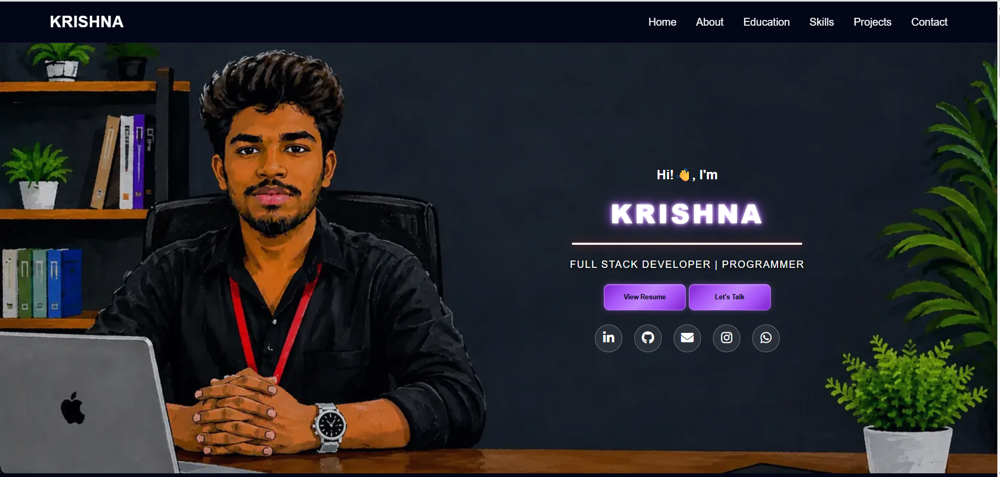

# 👨‍💻 Krishna | Personal Portfolio

Welcome to my personal portfolio website! 🚀

This portfolio showcases my **skills, projects, education, and experience** as a Computer Science Engineering student and aspiring Full Stack Developer.

🌐 **Live Website:** www.ckrishna.in

---

## ✨ Features

* 🎬 Cinematic opening animation
* 🌙 Modern dark-themed UI
* 💜 Violet glow effects and animated elements
* 📱 Fully responsive design
* 💻 Desktop and mobile optimized
* 👨‍💻 About Me section
* 🛠️ Skills & Technologies section
* 🎓 Education section
* 🚀 Projects showcase
* 📩 Contact section
* 🔗 Social media integration
* ⚡ Smooth scrolling and interactive animations
* 🎨 CSS-based visual effects

---

## 🛠️ Technologies Used

### Frontend

* HTML5
* CSS3
* JavaScript
* Font Awesome

### Tools & Platforms

* Git
* GitHub
* GitHub Pages
* VS Code

### Technologies & Skills

* Java
* JavaScript
* HTML
* CSS
* MySQL
* Git & GitHub
* Full Stack Web Development

---

## 📂 Project Structure

```text
My-Portfolio/
│
├── index.html
├── style.css
├── script.js
│
├── Images/
│   ├── profile.webp
│   ├── logo.webp
│   └── ...
│
└── README.md
```

---

## 🎨 Website Sections

### 🏠 Home

The landing section introduces me with an animated hero area and highlights my roles and interests.

### 👨‍💻 About

A short introduction about my background, interests, and development journey.

### 🛠️ Skills

A collection of programming languages, technologies, and development tools that I work with.

### 🎓 Education

My educational background and academic journey.

### 🚀 Projects

A showcase of the projects I have developed while learning and working with different technologies.

### 📩 Contact

Visitors can use the contact section to get in touch with me for opportunities, collaborations, or freelance work.

---

## 📱 Responsive Design

The portfolio is designed to provide a smooth experience across different screen sizes:

* 🖥️ Desktop
* 💻 Laptop
* 📱 Mobile
* 📟 Tablet

The layout, navigation, animations, and content automatically adapt to smaller screens.

---

## 🎬 Animation

The website includes a custom cinematic introduction created using **HTML and CSS animations**.

The opening sequence introduces my name before transitioning into the main portfolio website.

---

## 🚀 Getting Started

To run this project locally:

### 1. Clone the repository

```bash
git clone https://github.com/tchkrishna/My-Portfolio.git
```

### 2. Open the project

```bash
cd My-Portfolio
```

### 3. Run the website

Open `index.html` in your browser.

You can also use **Live Server** in VS Code for a better development experience.

---

## 🌐 Deployment

This portfolio is deployed using **GitHub Pages**.

🔗 Live Website:

www.ckrishna.in

---

## 📸 Portfolio Preview

<p align="center">
  
</p>

---

## 📬 Contact

If you'd like to connect with me, feel free to reach out through my portfolio.

**Krishna**
📍 Ozili, Tirupati(dt), Andhra Pradesh, India

💼 Full Stack Web Development
🚀 Open to learning, collaboration, and development opportunities.

---

## 🔗 Connect With Me

* 💻 GitHub: https://github.com/tchkrishna
* 💼 LinkedIn: https://www.linkedin.com/in/ckrishna147/
* 📸 Instagram: https://www.instagram.com/_c_krishna_/ 

---

## ⭐ Support

If you like this portfolio, consider giving the repository a ⭐ on GitHub!

---

## 📄 License

This project is created and maintained by **Krishna**.

© 2026 Krishna. All rights reserved.
